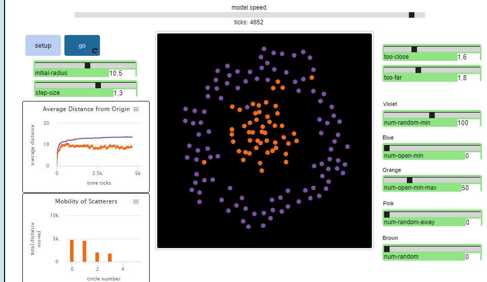
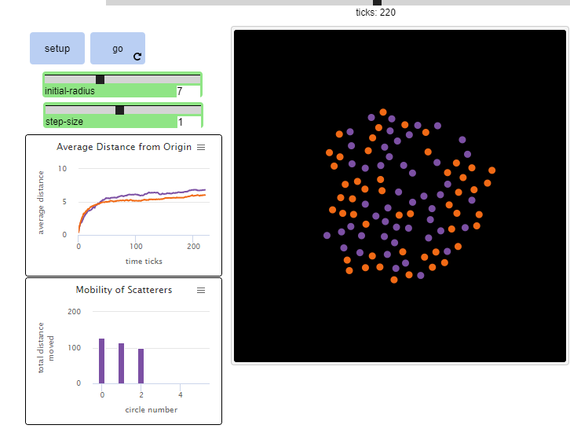
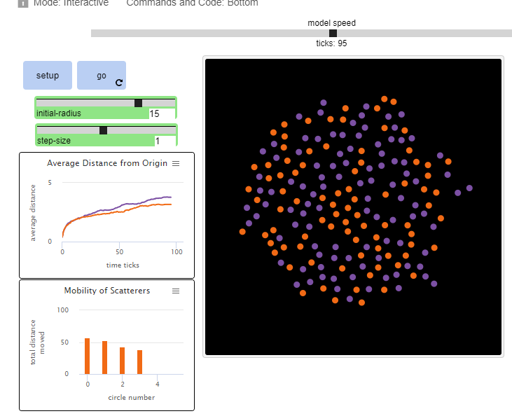

## Імітаційне моделювання комп'ютерних систем
## СПм-21-2, **Кравець Владислав Євгенович**
### Лабораторна робота №**1**. Опис імітаційних моделей та проведення обчислювальних експериментів

 

### Вибрана модель у середовищі NetLogo:
[Scatter](http://www.netlogoweb.org/launch#http://www.netlogoweb.org/assets/modelslib/Sample%20Models/Social%20Science/Scatter.nlogo)

 

### Вербальний опис моделі:
Ця модель імітує уявлення студентів про розсіювання, яке відбувається безпосередньо перед заняттями в тренажерному залі. Учні в класі починають зібрання купками, а вчитель просить їх розійтися або розійтися. Це моделювання показує розподіл групи, коли окремі студенти дотримуються простих правил, щоб вирішити, чи рухатися і куди. Розсіювачі рухаються за правилами, які були почерпнуті з кількох інтерв’ю з учнями шостого класу.

Студентів запитали: «На початку уроку фізкультури учні стоять близько один до одного. Учитель каже учням розійтися, щоб вони могли виконувати гімнастику. Що відбувається? Чи можете ви описати та пояснити?» Учні словесно описували процес розсіювання, використовуючи монети для імітації процесу та малюючи серію малюнків, щоб зобразити наступні кроки.

### Керуючі параметри:
- **RANDOM-MIN** Рухайтесь у довільному напрямку, доки не відійдете достатньо далеко від усіх своїх сусідів. Random-min студенти (фіолетові) встановлюють свій курс і рухаються у випадковому напрямку тоді і тільки тоді, коли є люди, що надто близько.
- **OPEN-MIN** Перейдіть у найбільший відкритий простір поблизу, доки ви не будете достатньо далеко від усіх своїх сусідів. OPEN-MIN (сині) також зупиняються, коли інші повзунки надто близько. Якщо повзунки знаходяться надто близько, вони знаходять напрямок, який приведе їх до найбільшого відкритого простору.
- **OPEN-MIN-MAX** Перейдіть у найбільший відкритий простір поблизу, доки ви не будете достатньо далеко, але не надто далеко. Якщо ви занадто близько, відійдіть. Якщо ви занадто далеко, підійдіть ближче. Open-min-max (помаранчеві) переміщаються до найбільшого відкритого простору, якщо інші надто близько. Якщо інші люди надто далеко (тобто в певному просторі безлюдно), то об'єкт про який йде мова, переміщається в більш населену територію.
- **RANDOM-AWAY** Рухайтесь у довільному напрямку від людини, яка вам найближча. Випадково віддалені люди (рожеві) дивляться на найближчу до них персону та рухаються у протилежному напрямку.
- **RANDOM** Рухайтеся випадковим чином, не звертаючи уваги на інших розсіювачів. Випадкові люди (коричневі) просто бігають у випадковому напрямку, ніколи не дивлячись на людей навколо них.
Учні, що розбігаються, рухаються з однаковими швидкостями, якщо взагалі рухаються. Два студенти не можуть займати одне місце. Пересуватися чи ні і куди рухатися залежить від кожного з описаних правил. Колір розсіяних учнів відображає правило, якого вони дотримуються.
Графік СЕРЕДНЯ ВІДСТАНЬ ВІД ПОЧАТКУ показує середню відстань, яку студенти за певним правилом перемістили від свого початкового положення з часом. Він має кольорове кодування відповідно до кольорів людей.
Гістограма МОБІЛЬНОСТІ РОЗСІЮВАЧІВ відображає середню загальну відстань, яку переміщуются об'єкти в певному діапазоні від початку координат. Кожна зі смужок відображає середню загальну відстань до черепах у п’яти концентричних колах, що радіально відходять від центральної ділянки.

 

## Обчислювальні експерименти

### 1. Змініть повзунок STEP-SIZE і подивіться, як це вплине на модель. Чи забезпечує більший розмір кроку більш чи менш ефективне розсіювання?

<table>
<thead>
<tr><th>Довжина кроку</th><th>кількість переміщень</th></tr>
</thead>
<tbody>
<tr><td>0,5</td><td>297</td></tr>
<tr><td>0,8</td><td>219</td></tr>
<tr><td>1</td><td>164</td></tr>
<tr><td>1,3</td><td>161</td></tr>
<tr><td>1,5</td><td>117</td></tr>
</tbody>
</table>

В нашому випадку при великому кроці розсіювання займає менше часу.

### 2.Експериментуючи з об'єктами, що переміщуються в діапазоні, змінюйте повзунки TOO-CLOSE та TOO-FAR  одночасно з повзунком STEP-SIZE. Якщо розмір кроку занадто великий, а значення TOO-CLOSE і TOO-FAR створюють занадто вузький діапазон, чи розсіювачі коли-небудь осядуть?

Поставивши досить малий діапазон значення TOO-CLOSE і TOO-FAR та трохи піднявши довжину кроку, розсіювачі зовсім не зупиняються.

### 3. Спробуйте змінити ПОЧАТКОВИЙ РАДІУС, щоб зробити початкову форму щільнішою або більш розпростертою.

	

В більш щільному радіусі розсіювачі довше не можуть знайти собі місця.

